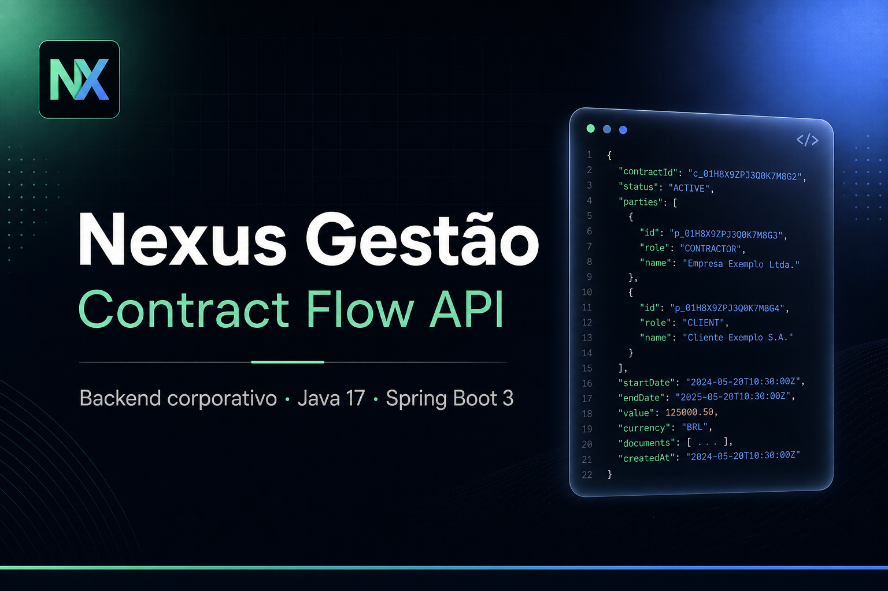
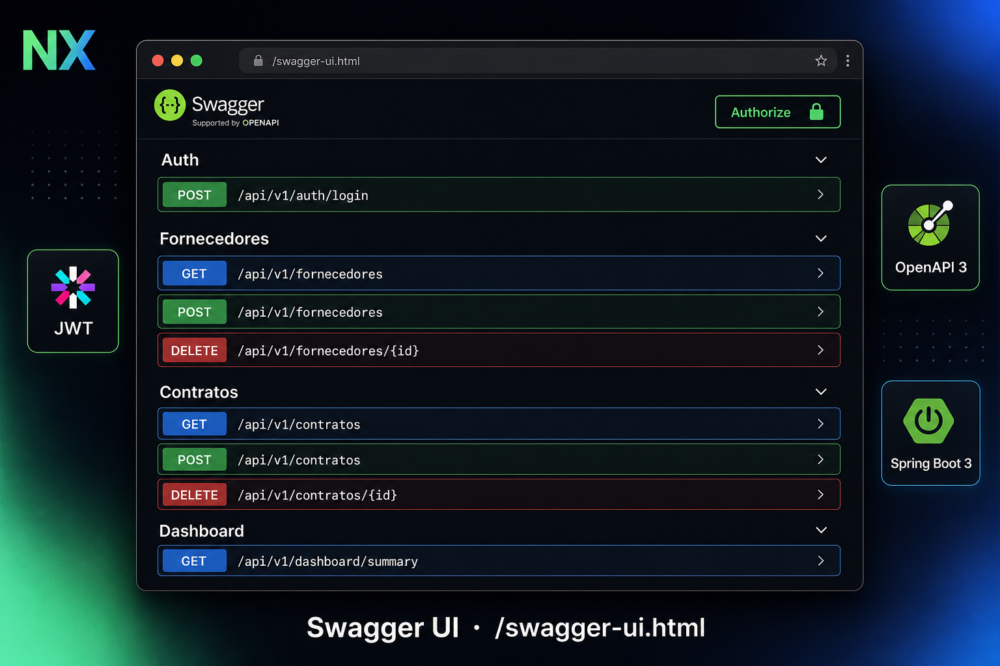
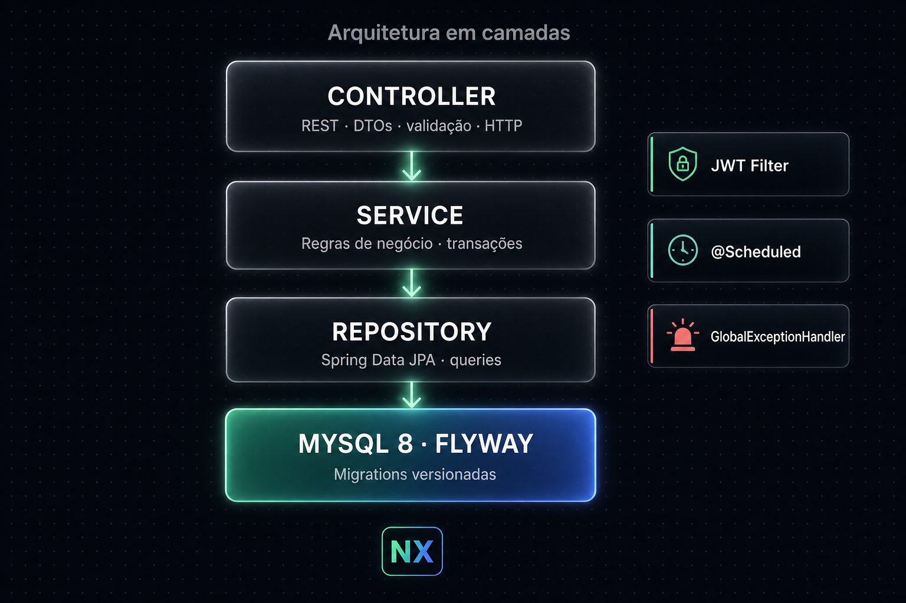
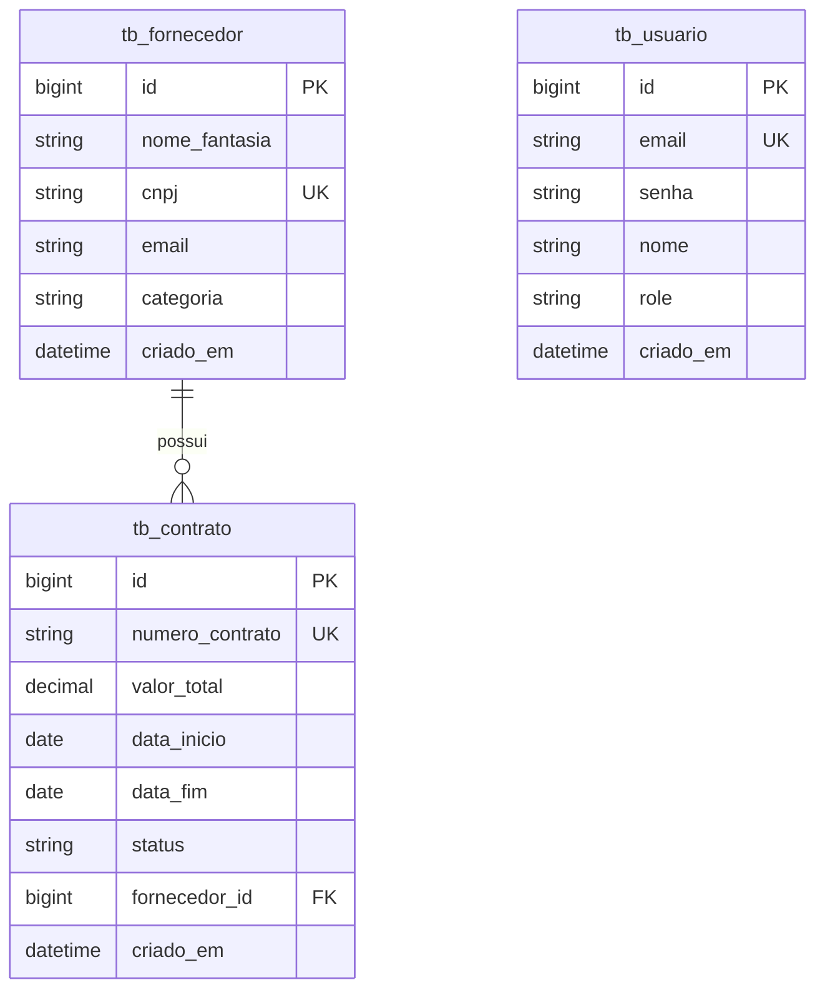

<p align="center">
  
</p>

# Nexus Gestão — Contract Flow

[](https://www.oracle.com/java/)
[](https://spring.io/projects/spring-boot)
[](https://www.mysql.com/)
[](https://jwt.io/)
[](https://swagger.io/)
[](https://opensource.org/licenses/MIT)

> Sistema corporativo de backend para **controle de ciclo de vida de contratos**, integração com fornecedores e automação de alertas de vigência.

## 🌐 Demo online

[](https://widineii.github.io/Nexus-Gest-o---Contract-Flow-API/)

**Landing page do projeto:** [https://widineii.github.io/Nexus-Gest-o---Contract-Flow-API/](https://widineii.github.io/Nexus-Gest-o---Contract-Flow-API/)

> A landing apresenta o projeto, stack, endpoints e arquitetura. Pra rodar o **Swagger UI interativo** (que precisa de backend rodando), siga a seção [Quick start](#quick-start-zero-config) abaixo — 1 comando, sem instalar nada além do Java.

**Credenciais de teste local:** `admin@nexus.com` / `admin123`

## Preview

<p align="center">
  
  <br/>
  <em>Swagger UI interativo em <code>/swagger-ui.html</code> — login, autorização JWT e teste de todos os endpoints sem precisar de Postman.</em>
</p>

<p align="center">
  
</p>

## Sumário

- [Stack](#stack)
- [Arquitetura](#arquitetura)
- [Pré-requisitos](#pré-requisitos)
- [Problemas comuns](#problemas-comuns-o-site-não-abre)
- [Como executar](#como-executar)
- [Variáveis de ambiente](#variáveis-de-ambiente)
- [Endpoints principais](#endpoints-principais)
- [Exemplos `curl`](#exemplos-curl)
- [Regras de negócio](#regras-de-negócio)
- [Modelagem](#modelagem-de-dados)
- [Scheduler](#scheduler)
- [Swagger UI](#swagger-ui)
- [Testes](#testes)

---

## Stack

- **Java 17** (LTS)
- **Spring Boot 3.3.x** (Web, Data JPA, Validation, Security)
- **MySQL 8.0** + **Flyway** (migrations versionadas)
- **JWT (jjwt 0.12.x)** com BCrypt
- **MapStruct** + **Lombok**
- **Springdoc OpenAPI 3** (Swagger UI)
- **JUnit 5** + Mockito + AssertJ + H2 (testes)

## Arquitetura

```
Controller  →  Service  →  Repository  →  MySQL
     ↓           ↓
    DTO        Mapper (MapStruct)
     ↓
GlobalExceptionHandler  →  ErrorResponse padronizado
```

Camadas separadas, DTOs para todo o tráfego HTTP (nunca expõe entidades), regras de negócio concentradas nos *services* e segurança *stateless* via filtro JWT.

## Pré-requisitos

- **Java 17+** (ou Java 21/25 — recomendado, já testado)
- *(opcional)* Maven 3.9+ — o `run.ps1` baixa automaticamente se não tiver
- *(opcional)* MySQL 8.0 — só se quiser sair do H2 em memória

## Quick start (zero-config)

> Não precisa instalar Maven, Docker ou MySQL. Só Java 17+.

Na pasta do projeto, **clique duas vezes em `run.bat`** (Windows) ou rode:

```powershell
.\run.ps1
```

O script:

1. Detecta o Maven; se não houver, baixa o Apache Maven 3.9.9 para `.mvn/` (uma única vez).
2. Sobe a API no perfil **`local`** com banco **H2 em memória** (sem MySQL).
3. Popula automaticamente: 1 admin + 4 fornecedores + 5 contratos de exemplo.

Quando ver `Tomcat started on port 8080`, abra no navegador:

| URL                                          | Descrição                            |
| -------------------------------------------- | ------------------------------------ |
| `http://localhost:8080/`                     | Redireciona para o Swagger           |
| `http://localhost:8080/swagger-ui.html`      | **Painel para testar a API**         |
| `http://localhost:8080/h2-console`           | Console SQL do banco H2 em memória   |

**Login no Swagger:** clique em `POST /api/v1/auth/login`, use:

```json
{ "email": "admin@nexus.com", "senha": "admin123" }
```

Copie o `token` da resposta, clique em **Authorize** (cadeado no topo), cole o token e teste todos os endpoints protegidos.

**H2 Console:** JDBC URL `jdbc:h2:mem:nexus`, usuário `sa`, senha em branco.

## Modo com MySQL (perfil `dev`)

Se quiser usar MySQL de verdade (executa os scripts Flyway `V1__schema.sql` / `V2__seed.sql`):

```bash
docker compose up -d                                # sobe MySQL 8 na porta 3306
.\run.ps1 -- -Dspring-boot.run.profiles=dev         # ou setar SPRING_PROFILES_ACTIVE=dev
```

Ou manualmente com `mvn spring-boot:run -Dspring-boot.run.profiles=dev`.

## Problemas comuns (“o site não abre”)

1. **`http://localhost:8080` em branco / erro**  
   A raiz redireciona para `/swagger-ui.html`. Se não funcionar, abra direto `http://localhost:8080/swagger-ui.html`.

2. **`mvn não é reconhecido`**  
   Use o `run.ps1` — ele baixa o Maven sozinho. Ou instale via `winget install Apache.Maven`.

3. **`Port 8080 already in use`**  
   Pare o processo na porta 8080 ou altere em `application.yml` → `server.port`.

4. **Esperava um “site” com layout**  
   Este projeto é só **backend (REST API)**. A “interface” oficial para portfólio é o **Swagger** (`/swagger-ui.html`).

## Variáveis de ambiente

| Variável       | Default                                              | Descrição                       |
| -------------- | ---------------------------------------------------- | ------------------------------- |
| `DB_USERNAME`  | `root`                                               | Usuário do MySQL                |
| `DB_PASSWORD`  | `root`                                               | Senha do MySQL                  |
| `DB_URL`       | `jdbc:mysql://localhost:3306/nexus_contract_flow...` | URL de conexão (prod)           |
| `JWT_SECRET`   | (chave de dev embutida)                              | Segredo base64 para assinar JWT |
| `SPRING_PROFILES_ACTIVE` | `dev`                                      | Perfil ativo (`dev` ou `prod`)  |

## Endpoints principais

Todos sob o prefixo `/api/v1`.

### Auth (públicos)

| Método | Path             | Descrição                          |
| ------ | ---------------- | ---------------------------------- |
| POST   | `/auth/register` | Registra novo usuário              |
| POST   | `/auth/login`    | Autentica e retorna `token` JWT    |

### Fornecedores (autenticado)

| Método | Path                            | Descrição                                |
| ------ | ------------------------------- | ---------------------------------------- |
| POST   | `/fornecedores`                 | Cadastra novo fornecedor                 |
| GET    | `/fornecedores`                 | Lista paginada (`?page=&size=&sort=`)    |
| GET    | `/fornecedores/{id}`            | Busca por ID                             |
| GET    | `/fornecedores/{id}/contratos`  | Todos os contratos do fornecedor         |
| DELETE | `/fornecedores/{id}`            | Exclui (bloqueado se houver ATIVOS)      |

### Contratos (autenticado)

| Método | Path                          | Descrição                                       |
| ------ | ----------------------------- | ----------------------------------------------- |
| POST   | `/contratos`                  | Cria contrato vinculado a fornecedor existente  |
| GET    | `/contratos/{id}`             | Busca por ID (status dinâmico)                  |
| GET    | `/contratos/vencendo`         | Lista os que expiram em até 30 dias             |
| PUT    | `/contratos/{id}/suspender`   | Suspende administrativamente                    |

### Dashboard (autenticado)

| Método | Path                | Descrição                                         |
| ------ | ------------------- | ------------------------------------------------- |
| GET    | `/dashboard/resumo` | Valor total ATIVOS, totais e alertas de vigência  |

## Exemplos `curl`

### 1) Login

```bash
curl -X POST http://localhost:8080/api/v1/auth/login \
  -H "Content-Type: application/json" \
  -d '{"email":"admin@nexus.com","senha":"admin123"}'
```

Resposta:

```json
{
  "token": "eyJhbGciOiJIUzI1NiJ9...",
  "tipo": "Bearer",
  "email": "admin@nexus.com",
  "role": "ADMIN",
  "expiresAt": "2026-05-13T18:05:30"
}
```

### 2) Listar fornecedores

```bash
curl http://localhost:8080/api/v1/fornecedores \
  -H "Authorization: Bearer <SEU_TOKEN>"
```

### 3) Cadastrar fornecedor

```bash
curl -X POST http://localhost:8080/api/v1/fornecedores \
  -H "Authorization: Bearer <SEU_TOKEN>" \
  -H "Content-Type: application/json" \
  -d '{
    "nomeFantasia": "Acme Cloud",
    "cnpj": "11222333000181",
    "email": "contato@acme.com",
    "categoria": "TI"
  }'
```

### 4) Criar contrato

```bash
curl -X POST http://localhost:8080/api/v1/contratos \
  -H "Authorization: Bearer <SEU_TOKEN>" \
  -H "Content-Type: application/json" \
  -d '{
    "numeroContrato": "CT-2026-100",
    "valorTotal": 150000.50,
    "dataInicio": "2026-06-01",
    "dataFim": "2027-05-31",
    "fornecedorId": 1
  }'
```

### 5) Contratos vencendo

```bash
curl http://localhost:8080/api/v1/contratos/vencendo \
  -H "Authorization: Bearer <SEU_TOKEN>"
```

### 6) Suspender contrato

```bash
curl -X PUT http://localhost:8080/api/v1/contratos/1/suspender \
  -H "Authorization: Bearer <SEU_TOKEN>" \
  -H "Content-Type: application/json" \
  -d '{"justificativa":"Reavaliação contratual em curso."}'
```

### 7) Resumo do dashboard

```bash
curl http://localhost:8080/api/v1/dashboard/resumo \
  -H "Authorization: Bearer <SEU_TOKEN>"
```

## Regras de negócio

| # | Regra                              | Implementação                                              |
| - | ---------------------------------- | ---------------------------------------------------------- |
| 1 | Vigência válida                    | `@AssertTrue` em `ContratoRequestDTO` + serviço            |
| 2 | CNPJ único e válido                | Validador customizado `@CNPJ` + constraint UNIQUE          |
| 3 | Status calculado em consulta       | `ContratoService.aplicarStatusDinamico()`                  |
| 4 | Scheduler diário à meia-noite      | `@Scheduled(cron = "0 0 0 * * *")` em `ContratoScheduler`  |
| 5 | Não excluir fornecedor com ativos  | `FornecedorComContratosAtivosException` (HTTP 409)         |
| 6 | Precisão monetária (2 decimais)    | `BigDecimal` + `setScale(2, HALF_UP)` + `@Digits`          |

## Modelagem de dados



## Scheduler

Roda diariamente à **meia-noite** (timezone do servidor):

- Busca contratos `ATIVO` com `data_fim < hoje`
- Loga cada mudança: `Contrato CT-2025-099 mudou para VENCIDO pelo sistema`
- Executa `UPDATE` em lote por performance
- Loga tempo total de execução

## Swagger UI

Acesse a documentação interativa em:

```
http://localhost:8080/swagger-ui.html
```

1. Faça login em `/auth/login` e copie o `token`.
2. Clique no botão **Authorize** (cadeado) e cole o token.
3. Teste qualquer endpoint diretamente pela UI.

## Testes

```bash
mvn test
```

Cobertura inclui:

- Validação de CNPJ (formato, dígito verificador, dígitos repetidos)
- Regra de vigência (dataFim < dataInicio)
- CNPJ duplicado
- Exclusão bloqueada com contratos ativos
- Status dinâmico de vencimento
- Precisão monetária

## Estrutura de pastas

```
src/main/java/com/nexus/contractflow/
├── NexusContractFlowApplication.java
├── config/         SecurityConfig, SwaggerConfig, JwtAuthFilter, ApplicationConfig
├── controller/     Auth, Fornecedor, Contrato, Dashboard
├── service/        Regras de negócio + Scheduler + JWT
├── repository/     Spring Data JPA
├── entity/         Fornecedor, Contrato, Usuario + enums
├── dto/            request/ + response/
├── mapper/         MapStruct (Entity ↔ DTO)
├── exception/      Customizadas + GlobalExceptionHandler
└── validation/     CNPJ custom validator
```

## Licença

MIT.
